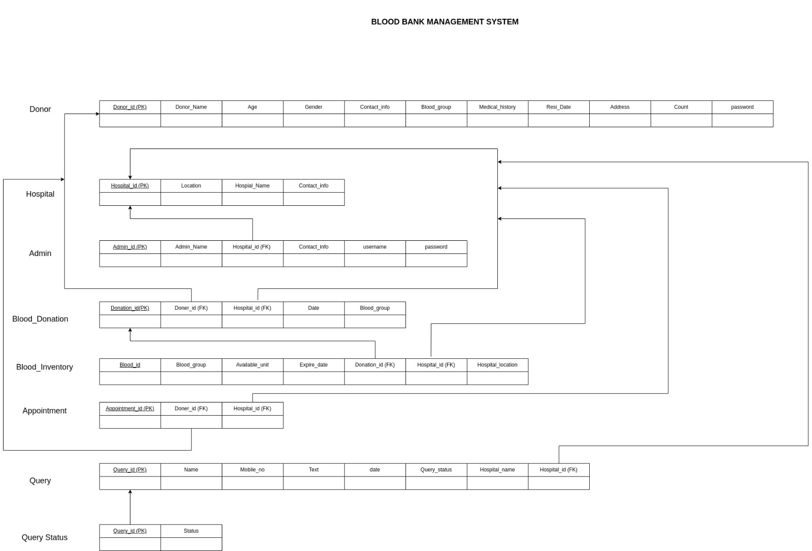

# Donate.me
Enhanced with additional functionalities beyond a typical Blood Bank System, our platform includes features such as the ability to schedule blood donation appointments and facilitate efficient blood searches through area pin codes.


## Content:
   1. [Setup](#setup)
   1. [Objective](#objectives)
   2. [Features](#features)
   2. [Challenges](#challenges)
   2. [Diagrams](#diagrams)
   <!-- 2. [Conclusion](#) -->


## 1. Setup
#### 1. Fork this repository & get on Local machine:
```bash
   git clone "<repository-link>"
```

#### 2. Setup Server (Backend)
1. Upgrade pip
   ```bash
   cd server/
   python -m pip install --upgrade pip
   #or
   python.exe -m pip install --upgrade pip --user 
   ```
3. Activate Virtual Environment ([GFG](https://www.geeksforgeeks.org/python-virtual-environment/))
   ```bash
   #bash shell
   source .venv/Scripts/activate
   ```
4. Install All Libraries
   ```bash
   pip install -r requirements.txt
   ```
5. Run Flask Server
   ```bash
   flask --app app run
   ```

#### 3. Setup Client (Frontend)
1. Installl Packages
   ```bash
   npm i 
   ```
2. Run react-app
   ```bash
   npm run start
   ```


## 2. Objectives
1. To develop a comprehensive Blood Bank System.
2. To implement advanced database concepts.
3. To Enhance user experience


## 3. Features
1. Hopital can register and login.
2. Doners can register and login.
3. OTP based verification of both registration.
4. Blood Search functionality to search availability of blood in particular area.
5. Users can make requests for blood to that hospital.
6. Doners can book appointment to hospitals.
7. Hospital admin has a dashboard to see availability of bloods, requests and appointments.
8. Hospital admin can reject request also appointments.


## 4. Challenges
1. To design frontend interactively.
2. To design and implement advance database queries.
3. Handling fonted requests and error handling.


## 5. Diagrams

1. Schema Diagram



